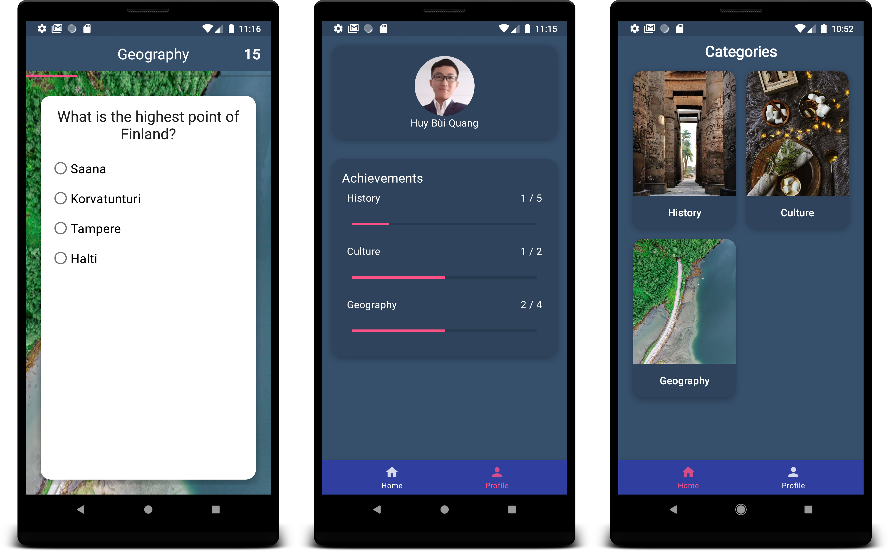

# Finniz

## What is Finniz?

Finniz is a free trivia game developed for Android phones. This application not only exercises your wit on a variety of topics about Finland.

## App’s Feature:
* User friendly interface
* User can see quiz progress. 
* The game is set in different categories in order for user to play based on choice. 

#### Google Playstore Link:
You can download it [here](https://play.google.com/store/apps/details?id=com.huy.finniz&hl=en)

## Technology Stack
* Kotlin
* Android Architecture Components
* Asynchronous programming: RxJava
* Dependency injection: Dagger2
* Cloud backend: Firestore
* Architecture patter: MVVM
